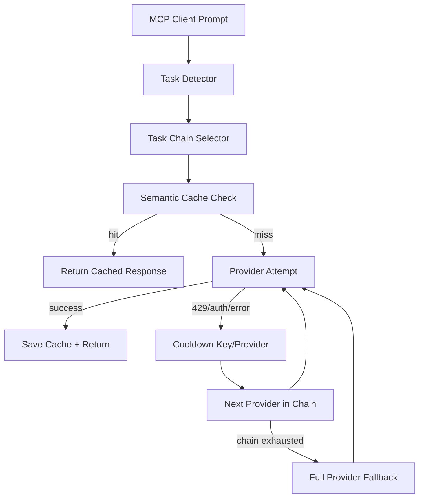

# Demo Storyboard

Use this for a GitHub README GIF, LinkedIn clip, or short launch video.

## 20-Second GIF

1. Prompt enters:
   ```text
   Prompt: "Write a Python scraper for Hacker News"
   ```
2. Task detection:
   ```text
   Task detected: code
   ```
3. Chain selection:
   ```text
   code chain: Kimi-K2 -> Qwen3-Coder -> MiMo-Pro -> NVIDIA -> DeepSeek -> SambaNova
   ```
4. Fallback moment:
   ```text
   Kimi-K2: rate limited
   Qwen3-Coder: selected
   ```
5. Cache replay:
   ```text
   Similar prompt detected
   Cache: semantic hit
   ```
6. End card:
   ```text
   Claude Code | Cursor | Windsurf | Continue.dev | Codex | Any MCP Client
   ```

## Algorithm

```text
1. Read prompt
2. Detect task
3. Select task-specific model chain
4. Check semantic cache
5. Try provider with active key
6. Cool down failing/rate-limited keys
7. Move to the next provider
8. Save successful response to cache
9. Return response to MCP client
```

## Mermaid Diagram



## Capture Tips

- Use a dark terminal, 120x32 size.
- Highlight only task detection, fallback, and cache hit.
- Export under 8 MB for GitHub and LinkedIn.
- Use green for success, amber for fallback, red for rate-limit.
